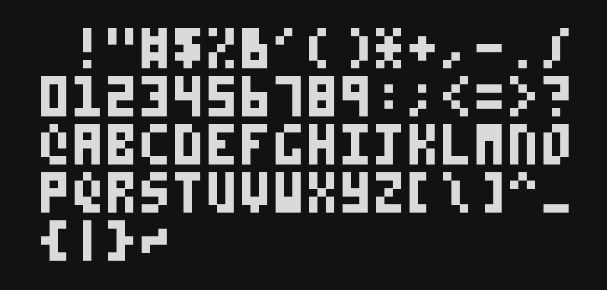

# textual-picofont

The retro-style PICO-8 font adapted for use in [Textual](https://github.com/textualize/textual/)

> [!WARNING]
> This project is currently a work in progress

## License

Licensed under the [MIT License](LICENSE)
